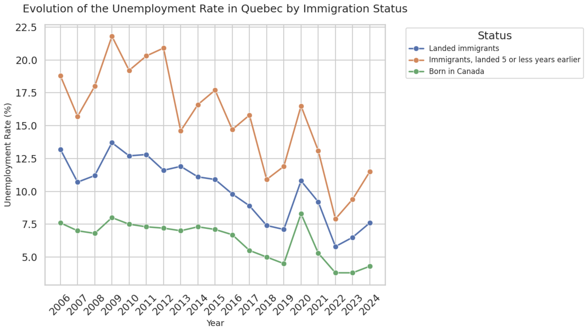
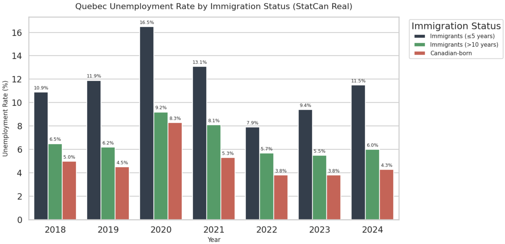
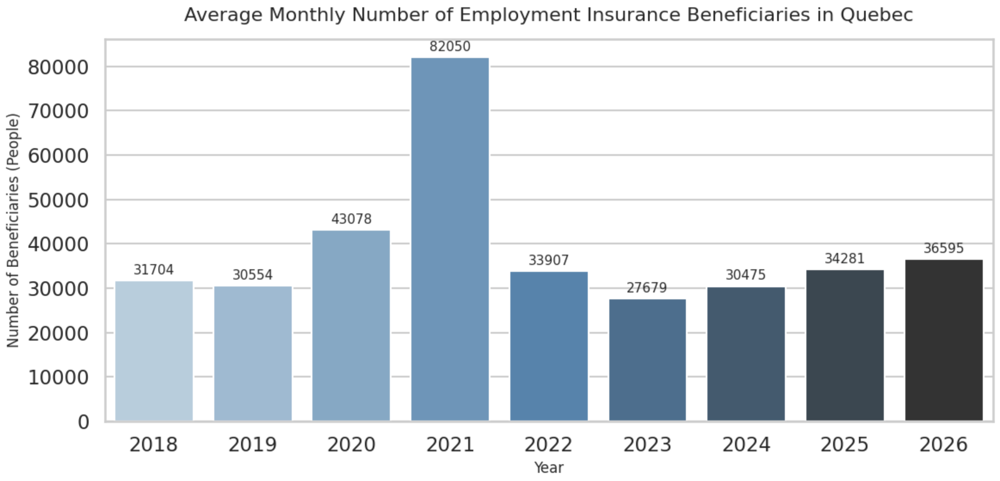

# Quebec Labor Market and Social Assistance Programs Analysis: Canadian-Born vs. Immigrants (2018–2024)

This project empirically analyzes the labor market integration of the immigrant population in Quebec compared to the Canadian-born population, evaluating their actual impact on the Employment Insurance system (*Assurance-emploi*) and the provincial Social Assistance program (*Aide financière de dernier recours / Bien-être social*).

The objective is to contrast the public narrative with official quantitative evidence from **Statistics Canada** and the **Ministère de l'Emploi et de la Solidarité sociale (MESS)**.

---

## Business and Public Policy Questions

1. **Is there a sustained structural disparity in unemployment based on length of residence?**
2. **Is there a correlation between immigration flows and the increase in employment insurance beneficiaries?**
3. **What is the legal and financial difference between the impact on federal employment insurance and provincial social assistance?**
4. **How does the *base rate fallacy* (relative percentages versus absolute volumes) affect public perception of the labor force?**

---

## Key Findings and Executive Takeaways

### 1. Integration Curve and Rapid Convergence
* **Transitory Initial Gap:** Recent immigrants ($\le$ 5 years of residence) experience a higher unemployment rate (**9.4% in 2023**), driven by typical integration factors (credential recognition, language barriers, and professional network development).
* **Structural Convergence:** After more than 10 years in the country, the rate drops to **5.5% in 2023**, significantly narrowing the gap with the Canadian-born population (**3.8%**). Immigrant unemployment is a transitional phase rather than a chronic issue of labor inactivity.

| Year | Canadian-Born (%) | Immigrants > 10 years (%) | Immigrants ≤ 5 years (%) |
|:---:|:-----------------:|:-------------------------:|:------------------------:|
| 2021 | 5.3% | 8.1% | 13.1% |
| 2022 | 3.8% | 5.7% | 7.9% |
| 2023 | 3.8% | 5.5% | 9.4% |



---

### 2. The Paradox of Absolute Volumes vs. Relative Rates
Although recent immigrants show a higher unemployment percentage, **the vast majority of the absolute volume of unemployed individuals in Quebec comes from the Canadian-born population**, due to the sheer size of the baseline labor force:

* In 2023, there were **138,400 Canadian-born individuals** seeking employment compared to **59,300 established immigrants**.
* In 2024, the number of unemployed Canadian-born individuals increased to **155,600**, while the immigrant group accounted for **73,600**.



> **Analytical Impact:** Evaluating labor market pressure solely through percentage rates creates a visual distortion; social support and placement services primarily serve the local population.

---

### 3. Employment Insurance: Driven by Economic Cycles, Not Immigration
* **Legal Mechanism:** Federal Employment Insurance requires prior contributions with a minimum accumulation of insurable hours worked in Canada. By design, asylum seekers and newcomers without prior formal local employment cannot access this benefit.
* **Temporal Trend:** The average monthly number of beneficiaries peaked in 2021 (**82,050 individuals**) due to pandemic operational restrictions, before declining and stabilizing at **27,679 in 2023** and **30,475 in 2024**, during a period characterized by record immigration arrivals.
* **Estimated Distribution:** Approximately **70% of regular benefits** are received by Canadian-born individuals, directly corresponding to their demographic weight and payroll contributions.



*Analytical Impact:* This breakdown confirms that the volume of regular benefit claimants aligns directly with native workforce participation rather than external inflows...

---

### 4. Provincial Social Assistance (*Bien-être social*): Exogenous Shock vs. Local Decline
Analyzing consolidated MESS records between 2019 and 2023 reveals two diverging trends:

1. **Decline in regular local recipients:** Beneficiaries from the general population decreased from **273,180 in 2019** to **204,063 in 2023** (a structural reduction of 25.3%).
2. **Growth in pending asylum claims:** The number of asylum seekers rose from **12,958 in 2021** to **69,160 in 2023** (+433%), a direct consequence of federal delays in issuing work permits and scheduling hearings.
3. **Institutional Effect:** Lacking legal access to federal contributory programs (EI), the regulatory framework channels this demographic segment into the provincial program of last resort until they secure legal work status.

| Year | General Population | Asylum Seekers | Total Beneficiaries | Asylum Share (%) |
|:---:|:------------------:|:--------------:|:-------------------:|:----------------:|
| 2019 | 273,180 | 24,587 | 297,767 | 8.3% |
| 2020 | 259,979 | 19,384 | 279,363 | 6.9% |
| 2021 | 234,270 | 12,958 | 247,228 | 5.2% |
| 2022 | 216,231 | 40,193 | 256,424 | 15.7% |
| 2023 | 204,063 | 69,160 | 273,223 | 25.3% |

---

## Data Sources and Methodology

1. **Labour Force Survey (LFS / EPA):**
   * Statistics Canada — [Table 14-10-0083-01](https://www150.statcan.gc.ca/n1/tbl/csv/14100083-eng.zip): Labour force characteristics by immigrant status and region.
2. **Employment Insurance (EI) Beneficiaries:**
   * Statistics Canada — [Table 14-10-0009-01](https://www150.statcan.gc.ca/n1/tbl/csv/14100009-eng.zip): Employment insurance beneficiaries receiving regular benefits by province and demographic group.
3. **Social Assistance Programs:**
   * *Rapport statistique sur la clientèle des programmes d'assistance sociale*, Ministère de l'Emploi et de la Solidarité sociale du Québec (MESS), 2019–2023 reporting periods.
   * Public Access to Information releases issued by the *Direction de l'intelligence d'affaires et de l'analytique* of the MESS (August 2024).

---

## Tech Stack

* **Python 3.10+**
* **Pandas:** Vectorized data manipulation, normalization, and multi-level aggregations.
* **Requests / Zipfile / IO:** Automated in-memory ingestion of open repositories without local disk footprint.
* **Matplotlib & Seaborn:** Production of executive-grade visualizations (grouped and stacked bar charts with analytical annotations).

---

## Execution and Reproducibility

1. Clone the repository:
 ```bash
  git clone https://github.com/georgepm31-lab/quebec-labor-immigration-analysis.git
   cd quebec-labor-immigration-analysis
   ```

2. Create and activate a virtual environment:
```bash
python -m venv venv
source venv/bin/activate  # On Windows: venv\Scripts\activate
```

3. Install required dependencies:
```bash
pip install -r requirements.txt
```
4. Run the notebook:
```bash
jupyter notebook notebooks/quebec_labor_analysis.ipynb
```
### requirements.txt file
Create this file in the root directory:
```text
pandas>=2.0.0
requests>=2.28.0
matplotlib>=3.7.0
seaborn>=0.12.0
stats_can>=2.3.0
jupyter>=1.0.0
```
